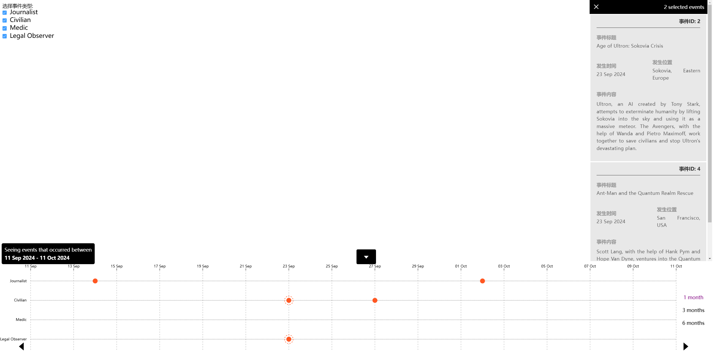

<h1 align="center">
  TimeLine v0
</h1>

<h3>If you are a beginner in D3.js, if you want to learn how to draw axes, understand how to implement dragging with D3.js, or have a project requirement to create a timeline, you can learn from and refer to this project. I believe you will find it helpful.</h3>

### Features
- Interactive timeline using D3.js and Vue.js
- Drag-and-drop support for smooth navigation
- Customizable event markers

### Tech Stack
- Vue.js 2
- D3.js 6
- SCSS

### How to Run
1. Clone the repository: `git clone https://github.com/username/timeline-project.git`
2. Install dependencies: `npm install`
3. Start the project: `npm run serve`

### Screenshots

